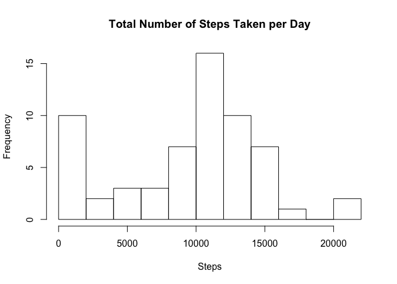
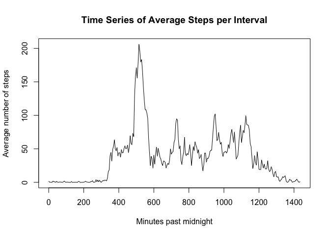
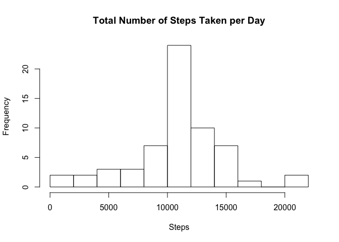
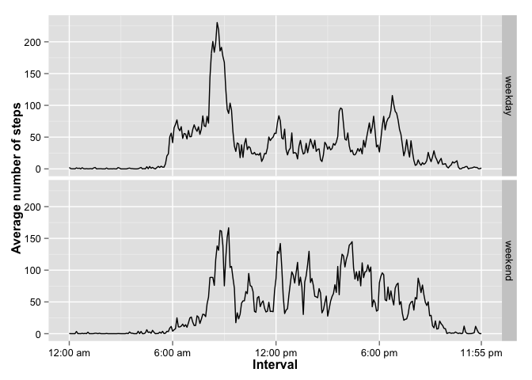

# Reproducible Research: Peer Assessment 1

## Introduction

It is now possible to collect a large amount of data about personal movement using activity monitoring devices such as a Fitbit, Nike Fuelband, or Jawbone Up. These type of devices are part of the “quantified self” movement – a group of enthusiasts who take measurements about themselves regularly to improve their health, to find patterns in their behavior, or because they are tech geeks. But these data remain under-utilized both because the raw data are hard to obtain and there is a lack of statistical methods and software for processing and interpreting the data.

This assignment makes use of data from a personal activity monitoring device. This device collects data at 5 minute intervals through out the day. The data consists of two months of data from an anonymous individual collected during the months of October and November, 2012 and include the number of steps taken in 5 minute intervals each day.

## Data

The data for this assignment can be downloaded from the course web site.

The variables included in this dataset are:

+ **steps:** Number of steps taking in a 5-minute interval (missing values are coded as NA)
+ **date:** The date on which the measurement was taken in YYYY-MM-DD format
+ **interval:** Identifier for the 5-minute interval in which measurement was taken

The dataset is stored in a comma-separated-value (CSV) file and there are a total of 17,568 observations in this dataset.

## Assignment

This report  answers the questions detailed below. 

### Loading and preprocessing the data

Show any code that is needed to:

1. **Load the data (i.e. read.csv())**


```r
unzip("activity.zip")
activity <- read.csv("activity.csv")
```

2. **Process/transform the data (if necessary) into a format suitable for your analysis**

Convert `date` to Date format


```r
activity$date <- as.Date(activity$date)
```

The intervals are stored HHMM format, meaning that they are not interval scale (evenly spaced) when the variable is interpreted as a numeric. In other words, there is a larger difference between `155` and `200` than between `200` and `205` *despite the fact that both sets of measurements are only five minutes apart*. This will create "jumps" in the line plots between the hours and make an inaccurate visualization. So convert them to minutes past midnight for the purpose of scaling the x-axes.


```r
# Start with the minutes past the hour for each interval
activity$minute <- activity[activity$interval < 100,]$interval

# Get the hours by removing the last two digits from the intervals
activity$hour <- as.numeric(gsub(".{1,2}$", "", activity$interval))

# If there was nothing left, the hour is 0
activity$hour[is.na(activity$hour)]  <- 0

# Minutes past midnight = (minutes past the hour) + (60 * hour)
activity$time <- activity$minute + (60 * activity$hour)
```

### What is mean total number of steps taken per day?

For this part of the assignment, you can ignore the missing values in the dataset.

1. **Calculate the total number of steps taken per day**


```r
library(plyr)
stepsPerDay <- ddply(activity, 
                     .(date), 
                     summarize,
                     numSteps = sum(steps, na.rm = TRUE))
```

2. **If you do not understand the difference between a histogram and a barplot, research the difference between them. Make a histogram of the total number of steps taken each day**


```r
hist(stepsPerDay$numSteps,
     main = "Total Number of Steps Taken per Day",
     xlab = "Steps", 
     breaks = 8)
```

 

3. **Calculate and report the mean and median of the total number of steps taken per day**


```r
meanSteps <- mean(stepsPerDay$numSteps)
medSteps  <- median(stepsPerDay$numSteps)
```

The mean total number of steps taken per day is **9354.23**.  
The median total number of steps taken per day is **10395**.


### What is the average daily activity pattern?

1. **Make a time series plot (i.e. type = "l") of the 5-minute interval (x-axis) and the average number of steps taken, averaged across all days (y-axis)**

First, create a data set that contains the average steps taken for each interval (as minutes past midnight).


```r
stepsPerInterval <- ddply(activity,
                          .(time, interval), 
                          summarize,
                          avgSteps = mean(steps, na.rm = TRUE))
```

Finally, plot the time series.


```r
with(stepsPerInterval, plot(time, avgSteps, type = "l", 
                            main = "Time Series of Average Steps per Interval",
                            ylab = "Average number of steps",
                            xlab = "Minutes past midnight"))
```

 

2. **Which 5-minute interval, on average across all the days in the dataset, contains the maximum number of steps?**

Sort the data in descending order by average number of steps. The interval from the first row is the one with the maximum number of steps.


```r
stepsPerInterval <- stepsPerInterval[order(stepsPerInterval$avgSteps, 
                                           decreasing = TRUE),] 
```

The interval with maximum number of steps, on average across all days in the dataset, is **835**.


### Imputing missing values

Note that there are a number of days/intervals where there are missing values (coded as NA). The presence of missing days may introduce bias into some calculations or summaries of the data.

1. **Calculate and report the total number of missing values in the dataset (i.e. the total number of rows with NAs)**


```r
totalNAs <- sum(is.na(activity$steps))
```

**2304** rows have missing step data.

2. **Devise a strategy for filling in all of the missing values in the dataset. The strategy does not need to be sophisticated. For example, you could use the mean/median for that day, or the mean for that 5-minute interval, etc.**

I will use the mean value for that 5-minute interval.

3. **Create a new dataset that is equal to the original dataset but with the missing data filled in.**


```r
activityImpute <- activity
for (i in 1:nrow(activityImpute)) {
  if(is.na(activityImpute$steps[i])){
    activityImpute$steps[i] <- 
      stepsPerInterval$avgSteps[stepsPerInterval$interval == 
                                  activityImpute$interval[i]]
    }
}
```

4. **Make a histogram of the total number of steps taken each day and Calculate and report the mean and median total number of steps taken per day. Do these values differ from the estimates from the first part of the assignment? What is the impact of imputing missing data on the estimates of the total daily number of steps?**

Calculate the total steps per day. Then, plot the histogram.


```r
stepsPerDayImpute <- ddply(activityImpute, 
                           .(date), 
                           summarize,
                           numSteps = sum(steps, na.rm = TRUE))

hist(stepsPerDayImpute$numSteps,
     main = "Total Number of Steps Taken per Day",
     xlab = "Steps", 
     breaks = 8)
```

 

Calculate the mean and median with the imputed data.


```r
meanStepsImpute <- mean(stepsPerDayImpute$numSteps)
medStepsImpute  <- median(stepsPerDayImpute$numSteps)
```

The mean total number of steps taken per day is **10766.19**.  
The median total number of steps taken per day is **10766.19**.

Calculate the differences between these values and those and the values without imputed steps. 


```r
meanDiff <- meanStepsImpute - meanSteps
medDiff  <- medStepsImpute - medSteps
```

The new mean using the imputed values is **1411.96** steps larger than the mean without imputed values.  
The new median using the imputed values is **371.19** steps larger than the mean without imputed values.

The previous distribution was right skewed (mostly due to the large number of `0`s). Imputing median values for each interval added more values toward the center of the distribution and reduced the number of days with `0` steps. This brought the median and mean closer together and made them larger.

### Are there differences in activity patterns between weekdays and weekends?

For this part the weekdays() function may be of some help here. Use the dataset with the filled-in missing values for this part.

1. **Create a new factor variable in the dataset with two levels – “weekday” and “weekend” indicating whether a given date is a weekday or weekend day.**


```r
activityImpute$weekday[weekdays(activityImpute$date) == "Saturday" | 
                         weekdays(activityImpute$date) == "Sunday"] <- "weekend"
activityImpute$weekday[!(weekdays(activityImpute$date) == "Saturday" | 
                         weekdays(activityImpute$date) == "Sunday")] <- "weekday"
activityImpute$weekday <- as.factor(activityImpute$weekday)
```

2. **Make a panel plot containing a time series plot (i.e. type = "l") of the 5-minute interval (x-axis) and the average number of steps taken, averaged across all weekday days or weekend days (y-axis). See the README file in the GitHub repository to see an example of what this plot should look like using simulated data.**

First, calculate the steps per interval separately for weekdays vs. weekends. 


```r
stepsPerIntervalImpute <- ddply(activityImpute,
                                .(time, interval, weekday), 
                                summarize,
                                avgSteps = mean(steps))
```

Then plot the time series.


```r
xbreaks <- c(0,
             stepsPerInterval$time[stepsPerInterval$interval == 600],
             stepsPerInterval$time[stepsPerInterval$interval == 1200],
             stepsPerInterval$time[stepsPerInterval$interval == 1800],
             stepsPerInterval$time[stepsPerInterval$interval == 2355])

xlabels <- c("12:00 am", "6:00 am", "12:00 pm", "6:00 pm", "11:55 pm")

library(ggplot2)
timeplot <- ggplot(stepsPerIntervalImpute, 
                   aes(x=time, y=avgSteps)) + 
  geom_line() + 
  scale_x_continuous(name = "Interval", 
                     breaks = xbreaks, 
                     labels = xlabels) + 
  scale_y_continuous(name = "Average number of steps", 
                     breaks = c(0, 50, 100, 150, 200, 250)) +
  facet_grid(weekday ~ .) + 
  theme(axis.title.x = element_text(face="bold"), 
        axis.title.y = element_text(face="bold"), 
        axis.text.x  = element_text(colour="#000000"), 
        axis.text.y  = element_text(colour="#000000"))
timeplot
```

 
